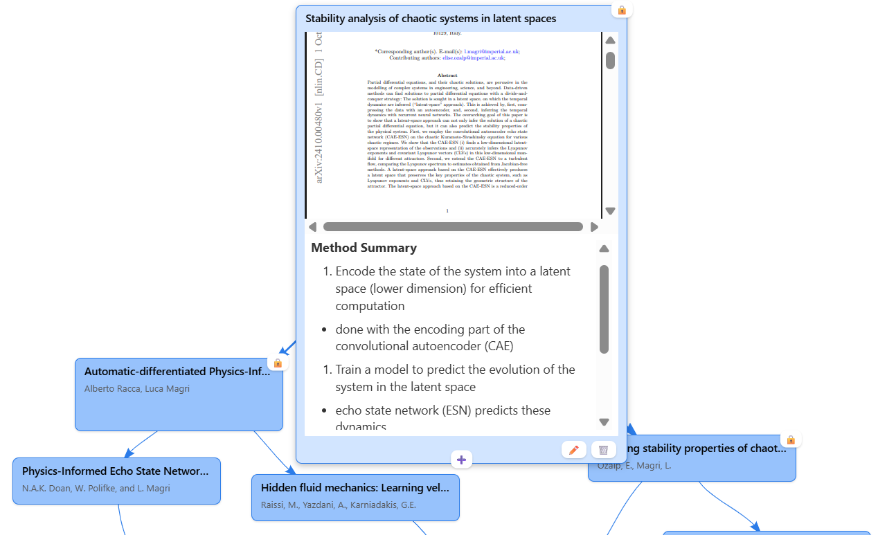

# BibWeb - Interactive Research Paper Network

BibWeb is a minimalistic tool to assist in the research process. The idea was born out of the frustration from never finishing reading a paper, because of the vast web of references that spring out of any one paper. Using this tool, one can easily keep track of follow-up papers and highlight the key links between them, whilst still maintaining a perspective on the bigger picture.



## ✨ Features

### 📊 Interactive Network Visualization
- **Distraction-free note taking**: Split-screen UI for reading and note-taking
- **Dynamic Graph Layout**: Physics-based and hierarchical layout modes
- **Importing and Exporting**: Easily create and import .json files to save your progress or share it with others

### 📝 Rich Paper Management
- **Comprehensive Metadata**: Title, authors, DOI and PDF links
- **Duplicate Detection**: Prevents duplicate papers by title matching
- **Notes System**: Full markdown support for detailed paper notes

### 🔗 Citation Network Building
- **Visual Connections**: Create directed citation relationships between papers
- **Reference Management**: Add citations with visual edge creation
- **Network Analysis**: Annotate the connections between nodes to understand paper relationships at a glance
- **Hierarchical Organization**: Organize papers in citation hierarchies

### 💾 Data Persistence & Export
- **Auto-save**: Changes are automatically saved to browser storage
- **Position Memory**: Node positions persist across sessions
- **Import/Export**: Transfer networks between devices via JSON files
- **Combined Notes**: Export all paper notes as a single organized document

## 🚀 Quick Start

### Option 1: View Online
- **GitHub Pages**: https://ben-eze.github.io/BibWeb/

### Option 2: Run Locally
1. **VS Code Live Server**: Install the "Live Server" extension, right-click `index.html`, select "Open with Live Server"
2. **Python HTTP Server**: Run `python -m http.server 8000` in the project folder
3. **Node.js HTTP Server**: Install with `npm install -g http-server`, then run `http-server`

## 📋 Usage Guide

### Adding Papers
1. Click **+ Add Paper** to open the paper form
2. Fill in paper details (title is required)
3. Add DOI, links, and notes as needed
4. Click the **+** icon to add related papers

### Creating Citations
1. Click on a paper node to select it
2. Click the **+** icon to add related papers
3. Either select an existing paper or create a new one
4. A directed edge will connect the papers

### Managing Layout
- **Physics Mode**: Drag nodes to arrange them, positions auto-save
- **Hierarchical Mode**: Automatic tree-like arrangement
- **Lock/Unlock**: Use toolbar buttons to prevent/allow node movement (useful for manually shaping the graph)

### Working with Notes
- Click **"Edit"** on any paper to add or modify notes
- Use **"Combine Notes"** in the toolbar to export all notes in hierarchical order
- Notes support full markdown formatting

## 🏗️ Technical Architecture

### Modern JavaScript Stack
- **ES6 Modules**: Clean, modular codebase
- **Vis-Network**: Powerful graph visualization library
- **Vanilla JavaScript**: No heavy frameworks, fast performance
- **CSS Grid/Flexbox**: Modern responsive layouts

### File Structure
```
BibWeb/
├── index.html              # Main application entry point
├── app.js                  # Application initialization
├── network.js              # Network setup and event handling
├── storage.js              # Data persistence (localStorage + file I/O)
├── toolbar.js              # Main toolbar functionality
├── paperForm.js            # Paper entry form management
├── nodeOverlays.js         # Node visual overlays and interactions
├── nodeToolbar.js          # Individual node toolbar actions
├── edgeToolbar.js          # Edge interaction tools
├── notesEditor.js          # Markdown notes editing
├── errorNotifications.js   # Error handling and notifications
├── style.css               # Application styles
└── webs/                   # Sample networks
    └── nice_web.json       # Example citation network
```

### Data Model
```javascript
// Paper Node Structure
{
  id: number,
  title: string,
  authors?: string,
  doi?: string,
  link?: string,
  type?: string,
  notes?: string,
  x?: number,        // Saved position
  y?: number,        // Saved position
  physics?: boolean  // Lock state
}

// Citation Edge Structure
{
  id: string,
  from: number,      // Source paper ID
  to: number,        // Target paper ID
  label?: string
}
```

## 🔧 Browser Compatibility

- **Chrome/Chromium**: Full support (recommended)
- **Firefox**: Full support
- **Safari**: Full support
- **Edge**: Full support

**Requirements**: Modern browser with ES6 module support

## 🤝 Contributing

### Development Setup
1. Clone the repository
2. Use a local HTTP server (see Quick Start)
3. Edit files and test changes
4. Submit pull requests

### Code Style
- Use ES6+ features and modules
- Follow existing code formatting
- Add comments for complex logic
- Test across different browsers

## 📄 License

This project is open source. See the repository for license details.

## 🔮 Roadmap

### Planned Features
- **Highlighting and Bookmarking**: Quickly find key passages in papers of interest
- **Enhanced Search**: Full-text search across papers and notes
- **Import/Export Formats**: Support for BibTeX, EndNote, Zotero
- **Visual Themes**: Dark mode and custom color schemes
